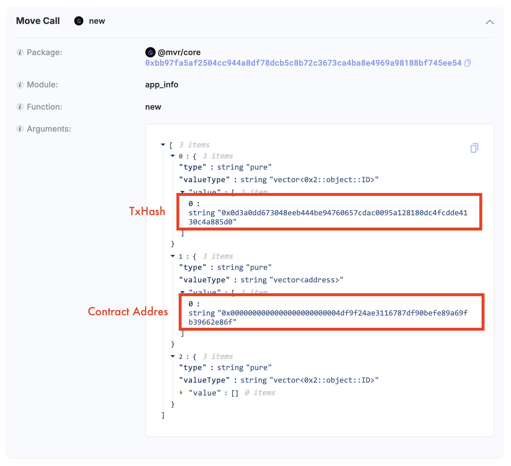
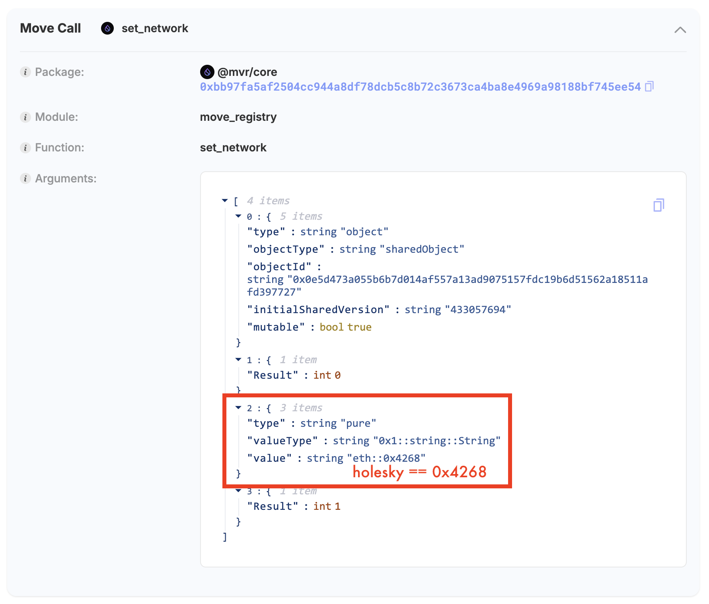

## 🧚 Multichain Verifiable Registry (MVR) – PoC

This repository demonstrates a proof-of-concept for extending [Sui's MVR (Move Verifiable Registry)](https://github.com/MystenLabs/mvr) to support **Ethereum smart contracts**.

### ✅ Goal

Cross-chain trust layers help verify the integrity of smart contracts across blockchains, making sure provenance is clear and reducing risks.

* Prove the **origin**, **build**, and **deployment** of a Solidity smart contract.
* Register the result as a verifiable `.intoto.jsonl` provenance file.
* Use **Sui MVR** as a cross-chain trust layer.

---

### ⚙️ Workflow

The [SLSA GitHub Generator](https://github.com/slsa-framework/slsa-github-generator) is used in this workflow to generate an `intoto.jsonl` file that formally attests to how the contract was built and deployed, following the SLSA (Supply-chain Levels for Software Artifacts) provenance standard.

This project uses **GitHub Actions** to:

1. **Compile** a Solidity contract (`Lock.sol`)
2. **Deploy** to Ethereum testnet (e.g., Holesky)
3. **Sign** the bytecode using a Sui key
4. **Generate** a provenance proof (`mvr.proof.json`)
5. **Encode** file hashes in base64
6. **Produce** an `intoto.jsonl` via [SLSA GitHub Generator](https://github.com/slsa-framework/slsa-github-generator)
7. **Register** the smart contract in MVR via app\_info

---

### 📁 Key Files

* `contracts/Lock.sol` – Example Solidity contract
* `scripts/deploy.js` – Deploys the contract and generates `mvr.proof.json`
* `.github/workflows/build-deploy.yml` – GitHub Actions automation
* `mvr.proof.json` – Contains signatures and deployment metadata
* `mvr.intoto.jsonl` – Final verifiable provenance document
* `scripts/register.js` – Registers the deployed contract and provenance to MVR

---

### 🔐 Requirements

In addition to secrets, GitHub Actions must be granted appropriate permissions (e.g., `id-token: write`, `contents: read`, and `actions: read`) to execute workflows involving provenance and reusable workflows like the SLSA generator.

* GitHub Secrets:

  * `PRIVATE_KEY_ETH` – Ethereum wallet private key
  * `PRIVATE_KEY_SUI` – Base64-encoded Sui secret key

---

### 📦 Outputs

* Verifiable build+deploy provenance
* Compatible with Sui MVR or tools like [notary.wal.app](https://notary.wal.app)

---

### 🦪 Example Use Case

```json
{
  "mvr": {
    "publicKey": "0x...",
    "signature": "..."
  },
  "network": {
    "chain": "eth::0x13882",
    "txHash": "0x1234...",
    "signature": "...",
    "contractAddress": "..."
  }
}
```

---

## 🚀 PoC Purpose and Structure

### 1. Workflow

  1.1. Build and deploy an Ethereum smart contract.
  1.2. Sign the generated bytecode using both Sui and Ethereum keys to create a deployment proof.
  1.3. Generate a provenance artifact (`mvr.proof.json`) containing the bytecode, signatures, and transaction hashes.
  1.4. Generate an `mvr.intoto.jsonl` file with this information and register it in the MVR.
  1.5. Ethereum lacks upgrade capability, so the provenance can only be registered under `app_info` rather than `package_info`.

---

### 2. Extended Ideas

#### 2.1. Multi-chain Expansion

* This could take the form of either extending the current `PackageInfo` structure or introducing a new type (e.g., `CrossChainPackageInfo`) for multi-chain scenarios—whichever direction aligns better with MVR’s design principles.

#### 2.2. Interaction with Multi-chain Smart Contracts

* Depending on the use case, this could involve deploying a Sui smart contract to interact with other blockchains and either reusing the existing `PackageInfo` structure or introducing a dedicated object for proxy-based interaction provenance.
* This would enable Sui to serve as a secure interaction hub between different blockchains.

#### 2.3. Integration with Real-world IoT Devices

* To support trusted interaction from physical devices, this could involve either extending MVR's metadata structures or creating a new object type designed specifically for device-level provenance.

---

This PoC shows how Sui MVR can serve as a practical and trustworthy hub for verifying provenance across blockchain and real-world scenarios.

---

### 🔗 Deployment Test Results

1. **GitHub Workflow Run: View on GitHub Actions:** [View on GitHub Actions](https://github.com/zktx-io/multichain-mvr-poc/actions/runs/15723947452)
2. **Ethereum Deployment Transaction:** [View on Etherscan](https://holesky.etherscan.io/tx/0x0d3a0dd673048eeb444be94760657cdac0095a128180dc4fcdde4130c4a885d0)
3. **Ethereum Contract Address:**: [View on Etherscan](https://holesky.etherscan.io/address/0x4df9f24ae3116787df90befe89a69fb39662e86f)
4. **Sui Deployment Transaction:** [View on Sui Explorer](https://suiscan.xyz/mainnet/tx/6quYPRJdgrJvbKj98P5UeYffrMvv7JpBJyPvHN6Pouf4)
5. **Sui MVR App Record Object:** [View MVR App Record Object](https://suiscan.xyz/mainnet/object/0xd6693e672db5230f064d16cb4306ca4102c5adcf5856327b0fe5d838b025a76f/fields)



